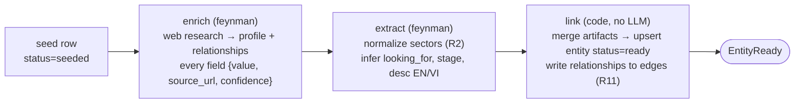
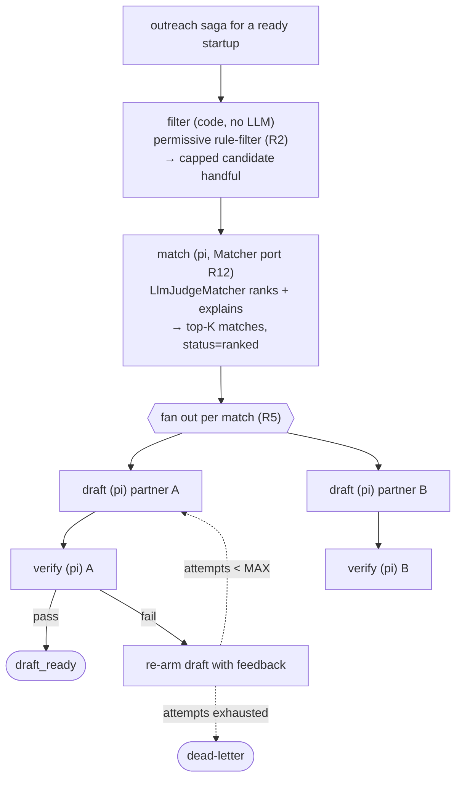
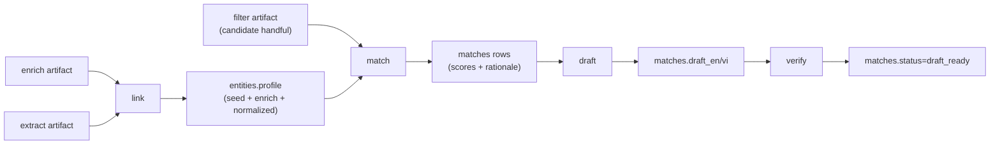

# AI Agents & Data Platform — How It Works

How the agent data platform actually runs: the runtimes, the contract between spine and
agent, and the two sagas that turn a seed name into a verified, bilingual introduction.
Companion to [`ARCHITECTURE.md`](ARCHITECTURE.md); design of record is the
[spec](superpowers/specs/2026-07-18-agent-data-platform-design.md).

## 1. Two runtimes, five agents

Agents are **declared, not coded** — `agents/specs.yaml` maps each saga stage to a
runtime, skill, tool set, and pool size. The model is **pinned** across all of them to
`deepseek/deepseek-v4-flash`.

| Agent | Runtime | Stage | Tools | Why |
|---|---|---|---|---|
| `enricher` | **feynman** | enrich | web_search, fetch_content, document_parse, read, write | Web research → provenance-rich profile + relationships |
| `extractor` | **feynman** | extract | fetch_content, document_parse, read, write | Normalize to canonical sectors, infer `looking_for` |
| `matcher` | **pi** | match | read | Rank + explain the filtered handful (LLM-as-judge) |
| `drafter` | **pi** | draft | read | Bilingual outreach email, non-time CTA |
| `verifier` | **pi** | verify | read | Strict compliance judge over the draft |

**feynman = crawler runtime.** It ships web tools by default and discovers its skills from
`.feynman/agent/skills` via `--cwd`. Launched as `feynman chat --mode rpc --model M --cwd
<repo>` (it rejects `--session-id/--skill/--tools`; the spine carries the output contract
in the prompt instead).

**pi = reasoning runtime.** Cheap, no web access. Launched as `pi --model M --mode rpc
--session-id W --skill P --tools ...`. Used for everything that reasons over data the
spine already has.

Splitting the runtimes keeps the expensive web-capable process off ranking/drafting —
`pi` (draft+verify+match) is ~$0.39 of the reference run; `feynman` (enrich) dominates at
$1.17.

## 2. The spine ↔ agent contract (R3)

Every agent stage is the same shape, so the spine treats all five uniformly:

```mermaid
sequenceDiagram
  participant S as Supervisor
  participant L as LocalProcessLauncher
  participant A as Agent process (pi | feynman)
  participant DB as Postgres

  S->>DB: acquire_job (lease, stage in DAG)
  S->>S: build_prompt(stage, job)  — embeds R3 output contract
  S->>L: spawn(spec, worker_id)  — fresh process (N=1)
  L->>A: exec CLI  --mode rpc
  S->>A: {"type":"prompt","message": <prompt>}
  A-->>S: {"type":"response","success":true}   (ACK — NOT done)
  A-->>S: turn_start / message_* / turn_end(usage,cost) ...
  A-->>S: agent_settled (pi)  /  agent_end willRetry=false (feynman)
  S->>S: extract terminal ```json block → validate vs schemas/<stage>.json
  alt valid
    S->>DB: record artifact + finish_stage (enqueue next stage, same txn)
    S->>DB: record llm_usage (one row per turn)
  else invalid / error
    S->>DB: fail_job (re-arm; prompt gains a strictness reminder on retry)
  end
  S->>A: close() — SIGKILL process group
```

The contract, enforced in `spine/transport.py`:

- **Request field is `message`** (not `text`/`prompt`/`content`).
- `{id, success:true}` is an **ACK, not completion**. A `success:false` ACK (e.g. missing
  API key) is surfaced as an error instead of hanging.
- **Completion** = `agent_settled` (pi) *or* `agent_end{willRetry:false}` + a short settle
  grace (feynman never emits `agent_settled`).
- Assistant text lives in `turn_end.message.content[].text`; **the terminal message must
  be a single fenced ` ```json ` block** — parsed by `extract_json_block`, validated
  against `schemas/<stage>.json`. Invalid → the job is re-armed and the retry prompt gains
  a "reply with ONLY a single fenced json block" reminder.
- `usage.cost` is a nested object → summed to a scalar and written to `llm_usage`.
- Isolation: **a fresh process per job (N=1)** is the session-hygiene guarantee (R7) — no
  warm context bleeds across targets. `close()` kills the whole process group so a
  feynman shim's node child can't keep spending.

Schemas live in `schemas/`: `enrich.json`, `extract.json`, `rank.json`, `draft.json`,
`verify.json`.

## 3. Saga 1 — Onboarding (per entity)

`ingest → enrich → extract → link → EntityReady`. Forward-recovery only.



- **enrich** gathers *real* public data from multiple sources. Hard rules in the prompt:
  every populated field carries a `source_url` actually visited; unfound fields are
  `value:null, confidence:"unavailable"` (never invented, R8); no PII for individuals;
  relationships surfaced in a top-level array (`raised_from`, `invested_in`, `pilot_with`,
  `founded_by_alumni_of`, `partner_with`).
- **extract** normalizes aggressively into a **shared bilingual sector space** so startup
  and partner tags intersect (`enterprise_ai`/`ai`, `clean_energy`/`cleantech`, `nông
  nghiệp`/`agritech`), and derives `looking_for`, `stage`, and EN/VI descriptions — only
  from the enriched data.
- **link** is pure code. It merges the two artifacts, upserts the entity to `status=ready`
  with the full provenance profile, and writes each relationship to `edges` with an
  **unresolved** `dst_id = name:{slug}` that resolves later when that entity onboards (R11).
  Idempotent (R9): safe to re-run.

## 4. Saga 2 — Outreach (per startup)

`filter → match → draft → verify`. Fans out per candidate partner.



- **filter** (code) runs a **deliberately permissive** rule-filter. Sector overlap is the
  *only* hard drop, and only when both sides carry sectors; a purpose (`looking_for`)
  mismatch never drops a partner — it just flags `low_confidence_filter` for the judge to
  down-rank. Candidates are sorted (high-confidence first) and capped before the LLM sees
  them. It must never collapse to zero (R2).
- **match** runs through the **`Matcher` port** (R12), so ranking is swappable. v1
  `LlmJudgeMatcher` makes one `pi` call to score every candidate 0–100 with EN/VI
  rationale (what aligns, the value created, one honest risk), keeps the top-K, writes
  `matches` rows `status=ranked`, and **fans out one `draft` job per match**. Out-of-set
  or unscorable partner ids from the model are dropped.
- **draft** (pi, per match) writes a bilingual intro email, primary language chosen by the
  partner's country. **Non-time CTA only** — "NIC will coordinate a convenient time"; it
  must not invent a date/slot (R15) or any fact beyond the supplied data.
- **verify** (pi, per match) is a strict LLM-judge over four checks: `facts_grounded`,
  `no_pii`, `language_ok`, `no_invented_times`. **Pass** → match `status=draft_ready`.
  **Fail** → route the concrete issues back into the draft job as `verify_feedback` and
  re-arm it (R5); once the draft exhausts `MAX_ATTEMPTS`, both jobs dead-letter.

The outreach saga is marked `done` when no active outreach job remains for it.

## 5. The blackboard: how data accumulates

Agents never talk to each other. They read and write **artifacts** keyed by
`(saga_id, step, target_id)` — a blackboard the spine mediates:



Each stage reads its predecessors' artifacts from Postgres and writes its own back.
Because artifacts upsert latest-wins on the unique key, re-running a stage overwrites
rather than forks — which is what makes crash recovery and idempotency free.

## 6. What the judge sees

The dashboard (`GET /entities` → `GET /matches?startup_id=…`) surfaces the whole chain per
startup: provenance-tracked fields with `source ↗` links and confidence, the ranked
partner cohort with composite scores, EN/VI rationale, the bilingual drafts, the
relationship graph, and live cost. Every claim traces back to a `source_url` an agent
actually visited — the anti-hallucination discipline is visible end to end.
