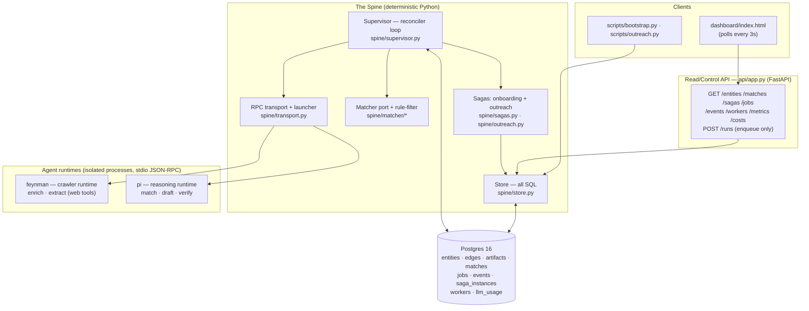

# Architecture

Deal-flow Matchmaker (problem #135, VAIC 2026 · NIC). This is the readable companion to
the full design of record in
[`superpowers/specs/2026-07-18-agent-data-platform-design.md`](superpowers/specs/2026-07-18-agent-data-platform-design.md).
Where they disagree, the spec wins.

## 1. The one idea

> A **deterministic Python spine** owns all state, orchestration, and I/O. Every **fuzzy**
> task (web research, extraction, ranking, drafting, verification) is pushed out to an
> **isolated LLM agent** that speaks a strict JSON contract. Postgres is the source of
> truth; the spine is a **reconciler**, not the record.

Nothing that must be correct depends on a model behaving. Nothing that must be smart is
hard-coded. The seam between the two is a validated JSON block.

## 2. Layer map

**Rule of the boundary:** the API never touches agents — `POST /runs` only *enqueues*.
A running `python -m spine.supervisor` is what actually advances work. This keeps the
read surface cheap and side-effect-free, and makes the agent spend observable and bounded
in exactly one place.

## 3. Components

| Component | File | Responsibility |
|---|---|---|
| **Supervisor** | `spine/supervisor.py` | Reconciler: adopt/orphan-kill on boot, lease + dispatch ready jobs under a global concurrency cap, reclaim expired leases. Owns all agent spawning + telemetry. |
| **Sagas** | `spine/sagas.py`, `spine/outreach.py` | The two workflows as stage DAGs. Build prompts, validate agent output against `schemas/*.json`, persist artifacts, advance the DAG transactionally. |
| **Matcher port** | `spine/matcher/__init__.py` | `Matcher` protocol (pluggable ranking, R12) + the deterministic permissive `rule_filter` (R2) + bilingual sector normalization. |
| **LlmJudgeMatcher** | `spine/matcher/llm_judge.py` | v1 Matcher: one `pi` call ranks + explains the filtered handful. No embeddings. |
| **Store** | `spine/store.py` | Every SQL statement. Leasing, idempotent upserts, event append, projections, cost ledger, `LISTEN/NOTIFY`. |
| **Transport** | `spine/transport.py` | `RpcChannel` (one prompt round-trip over stdio JSON-RPC), `LocalProcessLauncher`, `AgentSpec`. Knows the pi/feynman protocol quirks. |
| **Agent registry** | `agents/specs.yaml` | Declarative: which runtime/skill/tools/pool serve each stage. Model **pinned** to `deepseek/deepseek-v4-flash`. |
| **API** | `api/app.py` | FastAPI read model + `POST /runs`. Serves the dashboard. |

## 4. Why a spine + agents (the locked decisions)

| Decision | Choice | Reason |
|---|---|---|
| State ownership | Spine + Postgres, never the agent | Agents are stateless workers; nothing correct rides on model memory. |
| Agent isolation | Separate OS process per job (N=1) | No warm-context bleed across targets (R7); crash contained to one job. |
| Two runtimes | `feynman` = crawler (web tools), `pi` = reasoner (cheap, no web) | Match the tool surface to the task; keep the expensive web runtime off ranking/drafting. |
| Orchestration | Postgres-as-log sagas, **no message queue** | One dependency. `LISTEN/NOTIFY` wakes the scheduler; a poll fallback covers missed notifies. |
| Recovery | Forward-recovery only, no compensations | Re-run a failed stage; idempotency makes that safe. Simpler than sagas-with-rollback. |
| Ranking | Behind a `Matcher` port | Swap `LlmJudgeMatcher` → `EmbeddingMatcher`/`GraphRagMatcher` later with zero saga change. |

## 5. Data model at a glance

Three migrations, three concerns:

- **`001_core.sql` — domain.** `entities` (unified startups + partners, provenance-rich
  JSONB profile), `edges` (relationship graph, captured from day 1, consumed by future
  GraphRAG), `artifacts` (raw agent outputs / blackboard + audit trail), `matches`
  (ranked + drafted results).
- **`002_orchestration.sql` — workflow.** `jobs` (the queue, leased), `events`
  (append-only log = source of truth), `saga_instances` (folded projection, rebuildable
  from events).
- **`003_control_plane.sql` — operations.** `workers` (registry for orphan detection),
  `llm_usage` (one row per agent turn → the cost ledger behind `GET /costs`).

The invariants that make the spine safe live in the schema itself:

| Constraint | Guarantee | Rule |
|---|---|---|
| `entities.id = {type}:{slug(name)}` | Deterministic ids → re-running bootstrap/link never duplicates | R9 |
| `UNIQUE(artifacts: saga_id, step, target_id)` | Latest-wins upsert; a reclaimed/double-run job can't fork rows | R6 |
| `UNIQUE(jobs: saga_id, stage, target_id)` | Per-match idempotency key; guards double-dispatch | R5 |
| `events UNIQUE(saga_id, seq)` | Ordered, gap-checked event log | — |
| `jobs.lease_expires_at` | Dead worker's lease expires → reclaim loop requeues | R6 |

## 6. Reliability model

The spine is a reconciler over desired + leased state, so failure handling is uniform:

- **Crash recovery.** A job is leased with an expiry (`LEASE_SECONDS`). A worker that dies
  mid-job never renews; the reclaim loop flips it back to `ready` and a replacement picks
  it up. `RpcChannel.close()` SIGKILLs the whole child **process group** so a feynman
  shim's node child can't keep spending after we let go.
- **No double effects.** The two `UNIQUE` keys above mean a re-run produces the same row,
  not a second one.
- **Bounded retries → dead-letter.** A retryable sub-job (the draft↔verify loop) that
  exhausts `MAX_ATTEMPTS` is marked `dead` with a `DraftDeadLettered` milestone (R5).
- **Drain semantics.** `--drain` stops once no job for either saga is `ready`/`leased`.
  Safe because `finish_stage` enqueues the next stage in the *same transaction* that
  completes the current one — there is no zero-work window mid-saga.

`LEASE_SECONDS > AGENT_TIMEOUT` must hold (R6), or a slow-but-alive job gets reclaimed
out from under itself.

## 7. Observability & cost

- **Tracing.** Every row carries a `trace_id` (R10); structured logs bind
  `job_id/saga_id/trace_id/stage` per dispatch (`spine/telemetry.py`).
- **Cost ledger.** Each agent turn's `usage.cost` (a nested object on this host, summed to
  a scalar) is written to `llm_usage`. `GET /costs` and the dashboard header surface total
  spend, cost/entity, cost/match live. Reference cold-boot run: **$1.67 for 57 entities +
  125 matches** (R14).
- **Guardrails (deliberately light).** Model pinned; `MAX_CONCURRENCY` caps parallel
  spend; per-turn `AGENT_TIMEOUT`; retry budget `MAX_ATTEMPTS`.

## 8. Deployment shape

- `docker compose up -d postgres` — Postgres 16, migrations apply on init; `bootstrap.py`
  also runs an idempotent migration runner.
- The **supervisor and agent pools always run on the host** (`LocalProcessLauncher`,
  host `~/.pi` / `~/.feynman` auth). Agents are real local CLIs.
- The `api` service is containerized (`api/Dockerfile`) but optional.
- **WIP seam:** `ContainerLauncher` reuses the same `RpcChannel` to run a runtime in a
  container later — designed, not built (spec §12).

See the [README](../README.md) for the exact cold-boot command sequence, and
[`AGENT_FLOWS.md`](AGENT_FLOWS.md) for how a single entity travels through both sagas.
