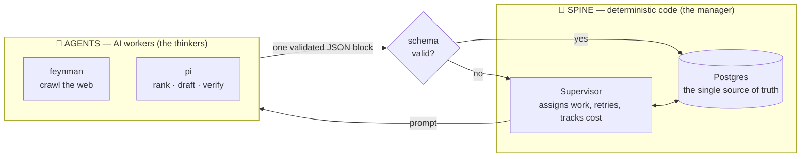
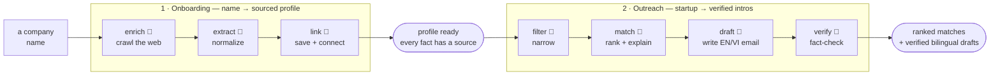

# Overview — What This Is

**Deal-flow Matchmaker** connects Vietnamese startups with the right partners — investors,
corporations, universities, research institutions — and drafts the introduction email in
both Vietnamese and English. It's the answer to VAIC 2026 problem #135 (sponsor: National
Innovation Center).

But the *way* it's built is the interesting part. This is an **AI agent data platform**.
This page explains what that means in one read. For the how, see
[`ARCHITECTURE.md`](ARCHITECTURE.md), [`AGENT_FLOWS.md`](AGENT_FLOWS.md), and
[`DESIGN_SYSTEM.md`](DESIGN_SYSTEM.md).

## What is an "AI agent data platform"?

A normal data pipeline is code that moves and transforms data through fixed steps. That
works when every step is a *precise* rule. It breaks the moment a step needs **judgment** —
"read this company's website and figure out what sector it's in," "explain why these two
organizations should talk," "write a warm email that invents no facts."

An **AI agent data platform** solves this by splitting the work in two:

| The **spine** (deterministic code) | The **agents** (AI) |
|---|---|
| Owns all data, order, and side effects | Do the fuzzy, judgment-heavy work |
| Never guesses; always correct | Never touch the database or the "truth" |
| Postgres, queues, retries, leases | Web research, extraction, ranking, writing |
| The part you can *trust* | The part that's *smart* |

The two meet at one narrow, guarded seam: the spine hands an agent a prompt, the agent
replies with a **single block of validated JSON**, and the spine checks it against a schema
before it's allowed to change anything. If the agent misbehaves, the JSON fails validation
and the spine simply retries — nothing incorrect ever lands.

> **The one-line mental model:** the agents are stateless *workers* doing the thinking;
> the spine is the *manager* that remembers everything, assigns work, and refuses to
> accept sloppy output. Postgres is the source of truth — the agents just visit.

## What it actually does

Two automated workflows ("sagas"), no human in the loop:

1. **Onboarding** — turn a bare company name into a rich, *sourced* profile.
   `enrich` (an agent crawls the real web) → `extract` (an agent normalizes it) → `link`
   (code saves it + records who's connected to whom). **Every fact carries the URL it came
   from**; anything the agent can't find is marked "unavailable" rather than invented.

2. **Outreach** — turn a startup into ranked, ready-to-send introductions.
   `filter` (code narrows the field) → `match` (an agent ranks partners and explains each
   fit) → `draft` (an agent writes the bilingual email) → `verify` (a second agent
   fact-checks the draft and rejects anything hallucinated).

The result, viewable on a live dashboard: each startup with its top partner matches, a
fit score, a bilingual rationale, a verified EN/VI draft email, and a source link behind
every claim.

## Why build it this way?

- **Trust.** Nothing that must be correct depends on an AI behaving. Every generated claim
  is either grounded in a cited source or thrown away.
- **Cheap and observable.** The whole reference run — 57 organizations, 125 matches —
  cost **$1.67**, and every cent is tracked per agent turn in a live cost ledger.
- **Recoverable.** If a worker crashes mid-task, the spine notices, requeues the work, and
  a fresh worker picks it up. Re-running anything is safe (it never duplicates).
- **Swappable brains.** Ranking sits behind a plug-in "port" — today it's an LLM judge;
  it can become embeddings or graph-based matching later with a one-line config change,
  no rewrite.

## The 30-second tour of the code

| You want to know… | Look at |
|---|---|
| The big picture, layers, data model | [`ARCHITECTURE.md`](ARCHITECTURE.md) |
| How the agents and the two sagas actually run | [`AGENT_FLOWS.md`](AGENT_FLOWS.md) |
| The dashboard's look & feel | [`DESIGN_SYSTEM.md`](DESIGN_SYSTEM.md) |
| The complete design of record | [`superpowers/specs/2026-07-18-agent-data-platform-design.md`](superpowers/specs/2026-07-18-agent-data-platform-design.md) |
| How to run it from zero | [`../README.md`](../README.md) |

## In one breath

> A deterministic Python spine backed by Postgres orchestrates isolated AI agent processes
> that crawl, extract, rank, draft, and verify — turning a list of company names into
> sourced profiles and verified bilingual introductions, fully automatically, for about
> three cents per organization.
