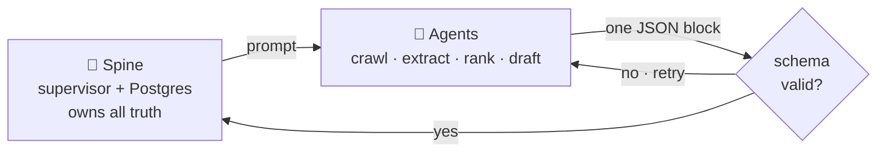

# VietNexus

## The matchmaker for Vietnam's innovation economy

VAIC 2026 · Challenge #135 "Deal-flow Matchmaker" · sponsored by NIC

🌐 Live now: <a href="https://dqplus.ddns.net">dqplus.ddns.net</a>

<!--
Everyone in this room knows fundraising in Vietnam runs on introductions. We spent this hackathon building the introduction machine — and it's already live. I'll show you the problem, what we shipped, and why the way we built it matters.
-->

---

# Good companies don't get funded — deal-flow runs on who you know

<v-clicks>

- 🚀 **Founders** spray-and-pray investors — and get ignored
- 💼 **Investors** drown in pitches that don't fit their thesis
- 🌏 **The language gap** hides Vietnamese startups from global capital

</v-clicks>

<!-- TODO visual: three-persona split with broken connection lines -->

<!--
Matching today is slow, manual, and network-bound. Founders can't tell which investors actually fit their industry, stage, and check size, so they blast everyone. Investors miss great companies that simply aren't in their circle. And a promising Vietnamese startup usually has no convincing English pitch, so international money never hears its story. Good companies don't get funded; good money doesn't reach them.
-->

---

# Tell VietNexus who you are — get a ranked shortlist, the why, and the intro email

- AI reads your profile into a structured summary
- Ranks the other side of the market: **meaning** + industry, stage, check size
- Every match **explains itself** in plain language
- One click → a ready-to-send introduction

<!-- TODO visual: screenshot of the live match list with reason chips ("same industry: fintech · matches your stage: seed") -->

<!--
The journey is five steps: sign up, the AI structures your profile, we rank everyone on the other side of the market, and every match comes with plain-language reasons — same industry, right stage, invests in your region — so you trust the list instead of guessing. Then one click gives you a ready-to-send intro. That's a cold-start problem turned into a warm introduction.
-->

---

# A deterministic spine commands AI agents — nothing made-up ever lands

- Semantic RAG (pgvector) + GraphRAG relationship signals
- Every fact keeps its source · a second AI fact-checks each draft — EN & VI

<!--
The interesting part is how it's built. Deterministic code — the spine — owns all data and side effects. AI agents do only the judgment work: crawling the web, extracting, ranking, drafting. They meet at one guarded seam: an agent returns a single block of JSON, and the spine schema-validates it before anything lands. Matching runs on multilingual embeddings over a pgvector corpus plus graph relationships. And every intro email is drafted bilingually, then fact-checked by a second AI against sourced evidence. Judges hear "AI" all day — our answer to hallucination is architectural, not a prompt.
-->

---
layout: fact
---

# dqplus.ddns.net

## Not a prototype — the full loop is in production right now

- Sign up → profile → AI extraction → ranked, explained matches — **live**
- Zero-downtime rolling deploys · end-to-end tests on a real vector DB
- Unfinished tabs say **"coming soon"** — no fake results

<!-- TODO visual: QR code linking to the live site -->

<!--
This isn't a slideware demo. The whole loop — register, onboard, AI extraction, ranked matches with reasons, outreach draft — runs end-to-end on the public internet today. We deploy with zero downtime and test every service end-to-end against a real database, no mocks. And where the product isn't finished — customers, partners, talent matching — the app says so honestly instead of pretending. You can try it from your phone right now.
-->

---

# From matching demo to Innovation OS in three phases

<b>Now</b> Investor matching live end-to-end

<b>Q4 2026</b> Customers, partners & talent · real hosting · mobile on live APIs

<b>2027</b> Learning-to-rank · GraphRAG-ranked intros · cohort mode for NIC programs

<!--
We're deliberate about sequencing. First, demo-hard: wire the fact-checked bilingual drafts into the app and add CI. Next quarter, the other three connection types light up — the entity model already supports corporations, universities, and research institutes — plus real hosting. In 2027 the platform starts learning: match outcomes tune the ranking, relationship graphs feed the rationale, and accelerators or government programs run their own cohorts on the same spine. That's when it earns the name Innovation OS.
-->

---
layout: end
---

# Give us a cohort

## Pilot VietNexus with NIC's next program

- One NIC accelerator cohort matched through VietNexus
- Intros to ecosystem partners feeding the entity corpus
- Team: [names & roles — fill in before presenting]

<!--
Here's what we're asking for. Beyond the challenge itself: give us one real cohort. Put a NIC program's startups and partners through VietNexus and measure the introductions that convert. The platform is live, the architecture doesn't hallucinate, and the roadmap is honest. Vietnam's ecosystem doesn't need another directory — it needs a matchmaker that never sleeps. We built it. Thank you.
-->
