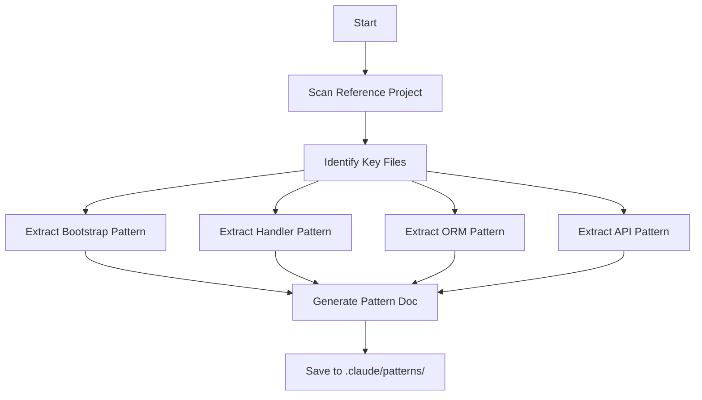

# Session `f0329cf6-ad43-4885-86d7-6981ee608f23`
- **Project:** `clone-market-entry-secrets`
- **Span:** 2026-07-17T17:41:57.079Z → 2026-07-17T18:25:19.178Z
- **Source:** `/home/delus/.claude/projects/-home-delus-Documents-code-hackathon-clone-market-entry-secrets/f0329cf6-ad43-4885-86d7-6981ee608f23.jsonl`

---


### 🧑 User  ·  _2026-07-17T17:42:07.774Z_

explain for me what does this source code do

---

### 🤖 Assistant  ·  _2026-07-17T17:42:14.742Z_

Which file or piece of code would you like me to explain? You haven't pointed me at a specific file yet — is it a particular file path, a function, or should I give an overview of the whole `market-entry-secrets` codebase?

---

### 🧑 User  ·  _2026-07-17T17:42:54.652Z_

scan all project and explain to me the intent

---

### 🤖 Assistant  ·  _2026-07-17T17:43:06.368Z_

I'll scan the key entry points of the project to verify and explain its intent.

---

### 🤖 Assistant  ·  _2026-07-17T17:43:07.530Z_

🔧 **Bash** → `{"command": "ls -la && echo \"---README---\" && (cat README.md 2>/dev/null | head -100) && echo \"---package.json---\" && cat package.json"}`

---

### 🧑 User  ·  _2026-07-17T17:43:08.862Z_

📎 _tool result_:
```
total 1068
drwxrwxr-x 18 delus delus   4096 Jul 18 00:41 .
drwxrwxr-x  3 delus delus   4096 Jul 18 00:41 ..
drwxrwxr-x 10 delus delus   4096 Jul 18 00:41 .claude
drwxrwxr-x  7 delus delus   4096 Jul 18 00:41 .git
drwxrwxr-x  3 delus delus   4096 Jul 18 00:41 .github
-rw-rw-r--  1 delus delus   2304 Jul 18 00:41 .gitignore
drwxrwxr-x  3 delus delus   4096 Jul 18 00:41 .lovable
-rw-rw-r--  1 delus delus    312 Jul 18 00:41 .mcp.json.example
-rw-rw-r--  1 delus delus  29634 Jul 18 00:41 CLAUDE.md
-rw-rw-r--  1 delus delus   7532 Jul 18 00:41 PLAN.md
-rw-rw-r--  1 delus delus   2149 Jul 18 00:41 README.md
-rw-rw-r--  1 delus delus 196650 Jul 18 00:41 bun.lock
-rw-rw-r--  1 delus delus 198351 Jul 18 00:41 bun.lockb
-rw-rw-r--  1 delus delus    413 Jul 18 00:41 components.json
drwxrwxr-x  2 delus delus   4096 Jul 18 00:41 daily-backlogs
drwxrwxr-x  4 delus delus   4096 Jul 18 00:41 data
-rw-rw-r--  1 delus delus 171726 Jul 18 00:41 deno.lock
drwxrwxr-x  3 delus delus   4096 Jul 18 00:41 design_handoff_ireland_country_page
drwxrwxr-x 11 delus delus   4096 Jul 18 00:41 docs
-rw-rw-r--  1 delus delus    789 Jul 18 00:41 eslint.config.js
drwxrwxr-x  3 delus delus   4096 Jul 18 00:41 eval
-rw-rw-r--  1 delus delus   3763 Jul 18 00:41 index.html
drwxrwxr-x  2 delus delus   4096 Jul 18 00:41 mentor_identification
-rw-rw-r--  1 delus delus 365144 Jul 18 00:41 package-lock.json
-rw-rw-r--  1 delus delus   3219 Jul 18 00:41 package.json
-rw-rw-r--  1 delus delus     80 Jul 18 00:41 postcss.config.js
drwxrwxr-x  3 delus delus   4096 Jul 18 00:41 public
drwxrwxr-x  2 delus delus   4096 Jul 18 00:41 reports
drwxrwxr-x 12 delus delus   4096 Jul 18 00:41 scripts
drwxrwxr-x 14 delus delus   4096 Jul 18 00:41 src
drwxrwxr-x  7 delus delus   4096 Jul 18 00:41 supabase
-rw-rw-r--  1 delus delus   3726 Jul 18 00:41 tailwind.config.ts
-rw-rw-r--  1 delus delus    635 Jul 18 00:41 tsconfig.app.json
-rw-rw-r--  1 delus delus    396 Jul 18 00:41 tsconfig.json
-rw-rw-r--  1 delus delus    481 Jul
… [truncated 5543 chars — see raw .jsonl]
```

---

### 🤖 Assistant  ·  _2026-07-17T17:43:13.002Z_

🔧 **Bash** → `{"command": "echo \"---src top-level---\" && ls src && echo \"---src/pages---\" && ls src/pages && echo \"---supabase/functions---\" && ls supabase/functions && echo \"---App.tsx head---\" && sed -n '1,60p' src/App.tsx"}`

---

### 🧑 User  ·  _2026-07-17T17:43:13.062Z_

📎 _tool result_:
```
---src top-level---
App.css
App.tsx
assets
components
config
constants
contexts
data
hooks
index.css
integrations
lib
main.tsx
pages
types
utils
vite-env.d.ts
---src/pages---
About.tsx
AdminMentors.tsx
AdminSubmissions.tsx
AgencyDetailPage.tsx
AuthCallback.tsx
Bookmarks.tsx
CaseStudies.tsx
CaseStudyDetail.tsx
Contact.tsx
Content.tsx
ContentDetail.tsx
Countries.tsx
CountryPage.tsx
EventDetailPage.tsx
Events.tsx
FAQ.tsx
Index.tsx
InnovationEcosystem.tsx
InnovationOrgPage.tsx
InvestorPage.tsx
Investors.tsx
LeadDatabaseDetailPage.tsx
Leads.tsx
LocationPage.tsx
Locations.tsx
MarketEntryQuestions.tsx
MemberHub.tsx
MentorConnections.tsx
MentorProfile.tsx
MentorsDirectory.tsx
MyReports.tsx
NotFound.tsx
PartnerWithUs.tsx
Pricing.tsx
PrivacyPolicy.tsx
ReportCreator.tsx
ReportCreatorV2.tsx
ReportView.tsx
ResetPassword.tsx
SectorPage.tsx
Sectors.tsx
ServiceProviderPage.tsx
ServiceProviders.tsx
SharedReportView.tsx
TermsOfService.tsx
TradeInvestmentAgencies.tsx
---supabase/functions---
_shared
admin-mentor-anonymity
ai-chat
classify-personas
create-checkout
demand-mining
deno.json
directory-discovery
directory-steward
email-assets
embed-knowledge
enrich-content
enrich-innovation-ecosystem
enrich-investors
firecrawl-map
firecrawl-scrape
firecrawl-search
generate-plan
generate-report
import-contact-images
ingest-events
kb-sync
knowledge-search
mcp
normalize-events
process-email-queue
prompt-ab-rollup
report-quality-loop
report-quality-rollup
rq-slack-actions
scrape-company
send-email
send-lead-followup
sitemap
slack-notify
stripe-webhook
stripe-webhook-reconcile
sync-lemlist
---App.tsx head---
import React, { Suspense } from "react";
import { Toaster } from "@/components/ui/toaster";
import { Toaster as Sonner } from "@/components/ui/sonner";
import { TooltipProvider } from "@/components/ui/tooltip";
import { QueryClient, QueryClientProvider } from "@tanstack/react-query";
import { BrowserRouter, Routes, Route, Navigate } from "react-router-dom";
import { HelmetProvider } from 're
… [truncated 3471 chars — see raw .jsonl]
```

---

### 🤖 Assistant  ·  _2026-07-17T17:43:25.815Z_

This confirms the picture. Here's the intent of the codebase:

## What this is

**Market Entry Secrets (MES)** — https://marketentrysecrets.com — a B2B SaaS product that helps foreign companies enter the Australian/ANZ market, and helps ANZ startups find the resources they need. It's built and deployed via **Lovable** (an AI app builder — the repo is two-way synced with a Lovable project) on top of **Supabase**.

## Core value proposition

1. **A directory** of everything a company needs to enter the ANZ market: service providers, mentors, events, lead databases, investors, innovation-ecosystem orgs, trade/government agencies, and case studies (`src/pages/*Directory*`, `*Page.tsx`).
2. **An AI-generated market-entry report** (`/report-creator`) — the product's centerpiece. A user answers an intake form, and a single edge function (`generate-report`) runs a multi-stage AI pipeline (Firecrawl company scrape + Perplexity market research + directory matching + Gemini/Anthropic section writing) to produce a 10-section report: SWOT, competitor landscape, matched service providers/mentors/investors, an action plan, compliance setup, etc. Higher-value sections are gated behind paid tiers.
3. **Two audience personas** — `international_entrant` (companies trying to enter ANZ) and `local_startup` (ANZ startups) — which reshape homepage/directory framing.

## Business model

Freemium: anonymous visitors get 3 free directory views before a paywall; signed-in members get free/growth/scale/enterprise tiers via **one-time Stripe payments** (not subscriptions) that unlock deeper report sections and features.

## Supporting machinery (why the repo is bigger than a typical SaaS)

- **RAG/knowledge base**: directory + content data is embedded and searchable (`mes_knowledge_base`, `knowledge-search` function) for both the report pipeline and an MCP server that lets external AI agents query MES data as tools.
- **Data ops**: Apify-driven events ingestion, Firecrawl-based enrichment of pr
… [truncated 767 chars — see raw .jsonl]

---

### 🧑 User  ·  _2026-07-17T17:46:40.891Z_

this product is help the startup go to market? so does it also support startup to connect with the VC/investor?

---

### 🤖 Assistant  ·  _2026-07-17T17:46:47.732Z_

🔧 **Bash** → `{"command": "echo \"---InvestorPage.tsx---\" && sed -n '1,150p' src/pages/InvestorPage.tsx; echo \"---grep contact/connect in investor related files---\" && grep -rniE \"contact|connect|intro\" src/pages/InvestorPage.tsx src/pages/Investors.tsx src/components 2>/dev/null | grep -i invest | head -50"}`

---

### 🧑 User  ·  _2026-07-17T17:46:47.822Z_

📎 _tool result_:
```
---InvestorPage.tsx---
import { useParams, useLocation, Navigate } from "react-router-dom";
import { PageSkeleton } from "@/components/ui/page-skeleton";
import { canonicalSlugRedirect } from "@/lib/canonicalRedirect";
import { FreemiumGate } from "@/components/FreemiumGate";
import { SEOHead } from "@/components/common/SEOHead";
import { EntityBreadcrumb } from "@/components/common/EntityBreadcrumb";
import { InvestorHero } from "@/components/investors/detail/InvestorHero";
import { InvestorContent } from "@/components/investors/detail/InvestorContent";
import { useInvestorBySlug, useRelatedInvestors } from "@/hooks/useInvestors";
import { NoIndex } from "@/components/common/NoIndex";

const InvestorPage = () => {
  const { slug } = useParams<{ slug: string }>();
  const { search, hash } = useLocation();
  const { data: investor, isLoading, error } = useInvestorBySlug(slug || "");
  const { data: relatedInvestors = [] } = useRelatedInvestors(
    investor?.id || "",
    investor?.investor_type || "",
    investor?.location || ""
  );

  if (isLoading) {
    return <PageSkeleton />;
  }

  if (error || !investor) {
    return (
      <div className="container mx-auto px-4 py-16 text-center">
        <NoIndex notFound />
        <h1 className="text-2xl font-bold mb-4">Investor Not Found</h1>
        <p className="text-muted-foreground">
          The investor you're looking for doesn't exist or has been removed.
        </p>
      </div>
    );
  }

  // Legacy UUID URLs redirect to the canonical slug URL (MES-80 / SEO-04).
  const redirectTo = canonicalSlugRedirect(
    slug,
    investor.slug,
    (s) => `/investors/${s}`,
  );
  if (redirectTo) return <Navigate to={`${redirectTo}${search}${hash}`} replace />;

  return (
    <>
      <SEOHead
        title={`${investor.name} | Australian Investors | Market Entry Secrets`}
        description={(investor.description || "").slice(0, 160)}
        canonicalPath={`/investors/${investor.slug || slug}`}
        ogImage={
… [truncated 5536 chars — see raw .jsonl]
```

---

### 🤖 Assistant  ·  _2026-07-17T17:46:52.401Z_

🔧 **Bash** → `{"command": "sed -n '1,120p' src/components/directory/IntroRequestProvider.tsx; echo \"---usage grep---\"; grep -rln \"IntroRequestProvider\\|useIntroRequest\" src/ | head -30; echo \"---mentor_contact_requests table refs---\"; grep -rln \"mentor_contact_requests\\|intro_request\" src/ supabase/ | head -30"}`

---

### 🧑 User  ·  _2026-07-17T17:46:52.492Z_

📎 _tool result_:
```
import { createContext, useCallback, useContext, useMemo, useState, type ReactNode } from "react";
import { WarmIntroModal, type IntroTarget, type IntroMode } from "./WarmIntroModal";

interface IntroRequestContextValue {
  /** Open the warm-intro flow for a person/company/investor/agency/hub. */
  requestIntro: (target: IntroTarget) => void;
  /** Open the soft enquiry flow for a lead list. */
  enquireLead: (target: IntroTarget) => void;
}

const IntroRequestContext = createContext<IntroRequestContextValue | null>(null);

/**
 * App-level host for the single warm-intro / lead-enquiry modal. Mounting this
 * once means every CardCTA can open the flow via useIntroRequest() without each
 * page wiring its own handler — closing the historic "dead Contact button" gap.
 */
export const IntroRequestProvider = ({ children }: { children: ReactNode }) => {
  const [target, setTarget] = useState<IntroTarget | null>(null);
  const [mode, setMode] = useState<IntroMode>("intro");
  const [open, setOpen] = useState(false);

  const requestIntro = useCallback((t: IntroTarget) => {
    setTarget(t);
    setMode("intro");
    setOpen(true);
  }, []);

  const enquireLead = useCallback((t: IntroTarget) => {
    setTarget({ ...t, entity: "lead_list" });
    setMode("enquiry");
    setOpen(true);
  }, []);

  const value = useMemo(() => ({ requestIntro, enquireLead }), [requestIntro, enquireLead]);

  return (
    <IntroRequestContext.Provider value={value}>
      {children}
      <WarmIntroModal target={target} mode={mode} isOpen={open} onClose={() => setOpen(false)} />
    </IntroRequestContext.Provider>
  );
};

export function useIntroRequest(): IntroRequestContextValue {
  const ctx = useContext(IntroRequestContext);
  if (!ctx) {
    // Defensive no-op so a stray card outside the provider never throws/dead-ends.
    if (typeof console !== "undefined") {
      console.warn("useIntroRequest used outside IntroRequestProvider; intro flow unavailable.");
    }
    return { requestInt
… [truncated 1909 chars — see raw .jsonl]
```

---

### 🤖 Assistant  ·  _2026-07-17T17:46:56.049Z_

🔧 **Bash** → `{"command": "sed -n '1,200p' src/components/directory/WarmIntroModal.tsx"}`

---

### 🧑 User  ·  _2026-07-17T17:46:56.094Z_

📎 _tool result_:
```
import { useState } from "react";
import { Dialog, DialogContent, DialogHeader, DialogTitle, DialogDescription } from "@/components/ui/dialog";
import { Button } from "@/components/ui/button";
import { Input } from "@/components/ui/input";
import { Textarea } from "@/components/ui/textarea";
import { Label } from "@/components/ui/label";
import { supabase } from "@/integrations/supabase/client";
import { useToast } from "@/hooks/use-toast";
import { Handshake, Send } from "lucide-react";
import { ENTITY_LABEL, type DirectoryEntity } from "./cardCtaConfig";

// Map our card entity onto the directory_submissions.submission_type CHECK
// (mentor | service_provider | trade_agency | innovation_organization |
//  investor | event | content | data_request).
const SUBMISSION_TYPE: Partial<Record<DirectoryEntity, string>> = {
  mentor: "mentor",
  service_provider: "service_provider",
  investor: "investor",
  agency: "trade_agency",
  innovation_hub: "innovation_organization",
};

export type IntroMode = "intro" | "enquiry";

export interface IntroTarget {
  entity: DirectoryEntity;
  id: string;
  name: string;
  /** Lead enquiry value signal (never a price). */
  recordCount?: number | null;
  sector?: string | null;
}

interface WarmIntroModalProps {
  target: IntroTarget | null;
  mode: IntroMode;
  isOpen: boolean;
  onClose: () => void;
}

/**
 * Persists a captured intro/enquiry into the appropriate public-funnel table
 * (anon INSERT is allowed there; everything else stays service-role / RLS).
 * A DB trigger on each table emits a `public.activity_events` row which the
 * existing slack-notify pipeline routes to #mes-ops.
 */
async function persistRequest(
  target: IntroTarget,
  mode: IntroMode,
  form: { name: string; email: string; company: string; country: string; phone: string; message: string },
): Promise<void> {
  // Lead-list enquiry -> lead_submissions. email/phone/sector/target_market are
  // NOT NULL on that table; the lead reference + requester ride i
… [truncated 5378 chars — see raw .jsonl]
```

---

### 🤖 Assistant  ·  _2026-07-17T17:47:06.958Z_

Yes — this confirms it directly. The product has a dedicated "warm intro" mechanism that covers investors specifically.

## How investor connections work

- **`/investors` directory** (`src/pages/Investors.tsx`, `InvestorPage.tsx`) — browsable, filterable list of Australian/ANZ investors (VC funds, angels, etc.), backed by an `investors_public` PII-safe view.
- **"Get a warm intro" CTA** on investor cards/profiles opens a shared `WarmIntroModal` (`src/components/directory/WarmIntroModal.tsx`) — the same mechanism used for mentors, service providers, agencies, and innovation hubs.
- Submitting the form inserts a request into `directory_submissions` (`submission_type: "investor"`) with the requester's name/email/company/country/message and the target investor's ID.
- A DB trigger fires an `activity_events` row, which the `slack-notify` pipeline routes to `#mes-ops` — so a human on the MES team is notified and does the actual introduction ("we'll connect you within 48 hours"). This is a manual/concierge intro, not an automated matching or in-app messaging system.
- The **AI report pipeline** also has an `investor_recommendations` report section (growth-tier+) that matches directory investors to the user's company profile as part of their generated market-entry report — so investor matches can also surface there, again pointing back to the same warm-intro flow.

So: **yes**, but it's a lead-gen/concierge model — MES surfaces relevant investors (via directory browsing or the AI report) and facilitates the *ask* for an intro; it doesn't run its own deal-flow, messaging, or investment infrastructure. It's the same "warm intro" pattern used for mentors and providers, just applied to the investor pillar too.

---

### 🧑 User  ·  _2026-07-17T17:47:58.019Z_

does this project belong to any startup / competitive? is there any intent that it public repo?

---

### 🤖 Assistant  ·  _2026-07-17T17:48:08.186Z_

🔧 **Bash** → `{"command": "echo \"---remote---\"; git remote -v; echo \"---git log author/org---\"; git log --format='%an <%ae>' | sort -u | head -20; echo \"---LICENSE---\"; ls LICENSE* 2>/dev/null || echo \"no LICENSE file\"; echo \"---package.json private---\"; grep -n '\"private\"' package.json; echo \"---.github workflows---\"; ls .github/workflows 2>/dev/null; echo \"---gitignore secrets check---\"; grep -niE \"env|secret|key\" .gitignore | head -20; echo \"---search for company/org name mentions---\"; grep -rniE \"urieljsc|lovable\\.dev/projects\" README.md package.json .lovable 2>/dev/null | head -10"}`

---

### 🧑 User  ·  _2026-07-17T17:48:08.307Z_

📎 _tool result_:
```
---remote---
origin	https://github.com/steviem101/market-entry-secrets (fetch)
origin	https://github.com/steviem101/market-entry-secrets (push)
---git log author/org---
Claude <noreply@anthropic.com>
Danny Mullan <43132178+dmullan17@users.noreply.github.com>
Stephen Mullan <stephen@irish-insights.com>
dmullan17 <43132178+dmullan17@users.noreply.github.com>
gpt-engineer-app[bot] <159125892+gpt-engineer-app[bot]@users.noreply.github.com>
steviem101 <stephen@marketentrysecrets.com>
---LICENSE---
(eval):1: no matches found: LICENSE*
no LICENSE file
---package.json private---
3:  "private": true,
---.github workflows---
ci.yml
deploy-edge-functions.yml
doc-freshness.yml
golden-eval.yml
---gitignore secrets check---
1:# MCP config (contains secrets)
5:client_secrets.json
26:# Environment files (may contain secrets)
27:.env
28:.env.local
29:.env.*.local
30:.env.production
31:.env.staging
---search for company/org name mentions---
README.md:5:**URL**: https://lovable.dev/projects/0a6d29c0-67b9-465b-bcae-39789bcc72d4
README.md:13:Simply visit the [Lovable Project](https://lovable.dev/projects/0a6d29c0-67b9-465b-bcae-39789bcc72d4) and start prompting.
README.md:65:Simply open [Lovable](https://lovable.dev/projects/0a6d29c0-67b9-465b-bcae-39789bcc72d4) and click on Share -> Publish.
```

---

### 🤖 Assistant  ·  _2026-07-17T17:48:23.023Z_

🔧 **Bash** → `{"command": "gh repo view steviem101/market-entry-secrets --json visibility,description,isPrivate,homepageUrl 2>&1 | head -20"}`

---

### 🧑 User  ·  _2026-07-17T17:48:23.732Z_

📎 _tool result_:
```
{"description":"","homepageUrl":"","isPrivate":false,"visibility":"PUBLIC"}
```

---

### 🤖 Assistant  ·  _2026-07-17T17:48:29.605Z_

🔧 **Bash** → `{"command": "grep -rniE \"competitor|vs\\.|alternative to\" docs/*.md docs/audits/*.md 2>/dev/null | grep -viE \"competitor_landscape|competitor recommendations|report\" | head -20"}`

---

### 🧑 User  ·  _2026-07-17T17:48:29.667Z_

📎 _tool result_:
```
docs/innovation-ecosystem-audit-2026-05-08.md:235:Below is a delta proposal vs. the original brief. **Nothing is implemented yet.** Awaiting approval.
docs/audits/MES-35-platform-readiness-scan.md:150:| **High quality** | All research streams healthy: Perplexity 6-stream research + citations, successful company deep-scrape with real `key_clients`, competitor + end-buyer coverage, full DB match slates per section, 4–6 parsed key-metric cards, polish applied (AU spelling, dedup, length discipline), all tier sections present. | All three API keys healthy + scrapeable target; polish must not time out; per-section retry on 429. |
docs/audits/homepage-audit.md:12:testimonials render. Competitor pages were captured live. Screenshots are in
docs/audits/homepage-audit.md:25:| 2 | Before vs. After | `BeforeAfterSection.tsx` | 1,187 px |
docs/audits/homepage-audit.md:157:## 2. Competitor teardown
docs/audits/homepage-audit.md:278:- **Competitor learnings applied:** Starter Story (one metric set, "Free" up front, product
docs/audits/homepage-audit.md:296:- **Competitor learnings applied:** Navigator (definition line, journey stages, single CTA),
docs/audits/homepage-audit.md:374:- All 5 competitor homepages captured with screenshots + takeaways (§2), each takeaway
docs/audits/mes-110-sector-taxonomy-audit.md:190:3. **Backfill dirty columns** (reviewed batch per table, `UPDATE … SET x = canonical, x_legacy = old` style): investors.sector_focus (with fragment repair), events.sector/category, trade_investment_agencies.sectors_supported, innovation_ecosystem.sectors, lead_databases.sector (+ `Cross-Industry` → `sector_agnostic=true`), content_company_profiles.industry, country_case_studies.sector, leads, lead_submissions, locations/countries/industry_sectors display arrays. Audience/thesis/stage values move to a `focus_tags`-style column (or are dropped with the legacy copy retained) — per-row decisions are already in the CSVs.
docs/audits/mes-182-guide-topic-taxonomy-audit.md:158:
… [truncated 2051 chars — see raw .jsonl]
```

---

### 🤖 Assistant  ·  _2026-07-17T17:48:43.039Z_

Good — both questions have solid evidence in the repo.

## 1. Real startup, and yes, it's competitive

This is a real, live commercial product, not a demo or sample repo:

- **Owner/founder:** commits are authored by `steviem101 <stephen@marketentrysecrets.com>` — this is Stephen Mullan's product. He also appears as `stephen@irish-insights.com` in the git history, and the codebase has a separate `ii_*` "Irish Insights pipeline" workstream (per CLAUDE.md) — likely a related/earlier venture in the same market-entry-advisory space.
- It runs live at **marketentrysecrets.com**, with a real production Supabase project, Stripe payments, Slack ops channels, a Notion ticket tracker, and an active CI/eval pipeline — this is operated as a business, not a toy project. The commit history shows it was originally scaffolded via **Lovable/GPT-Engineer** (`gpt-engineer-app[bot]` commits) and has since been actively engineered on top.
- **Competitively**, the repo's own SEO/homepage audits (`docs/audits/homepage-audit.md`, `docs/audits/seo-discoverability-audit-2026-07-04.md`) name direct competitors it benchmarks against — e.g. **Dearin & Associates** (a boutique market-entry consultancy blog), plus comparisons to government trade sites (trade.gov, NZTE) and other directory-style sites like **Starter Story** and **Navigator** for homepage patterns. So yes — MES positions itself against boutique market-entry consultancies and government trade resources, aiming to out-scale them with a directory + AI-report product.

## 2. Public repo — yes, and that's flagged as a live risk

I checked GitHub directly: `github.com/steviem101/market-entry-secrets` is **public** (`isPrivate: false`). There's no LICENSE file, and `package.json` has `"private": true` (which only blocks accidental `npm publish`, unrelated to GitHub visibility) — so there's no sign this was deliberately open-sourced with a license; it reads more like "public repo, not really meant for public consumption" than an intentiona
… [truncated 740 chars — see raw .jsonl]

---

### 🧑 User  ·  _2026-07-17T17:56:01.743Z_

what is the start commit date?

---

### 🤖 Assistant  ·  _2026-07-17T17:56:05.564Z_

🔧 **Bash** → `{"command": "git log --reverse --format='%H %ad %an' --date=iso | head -5"}`

---

### 🧑 User  ·  _2026-07-17T17:56:05.626Z_

📎 _tool result_:
```
1c7280c1b28e7579bc8341570e126bdd4b4d47aa 2025-06-09 04:16:06 +0000 gpt-engineer-app[bot]
b1cb0899aa1673aef129deac0de1ee8f85005102 2025-06-09 04:17:39 +0000 gpt-engineer-app[bot]
a403328ee39a0449248dcf9f86e4e9d747ceec6f 2025-06-09 04:21:40 +0000 gpt-engineer-app[bot]
d46e66b27abaa28c2caa85da0e71315a47253ca8 2025-06-09 04:23:45 +0000 gpt-engineer-app[bot]
cb3b0ea4d32e283dd05830de87e3155682f0aaa6 2025-06-09 04:28:00 +0000 gpt-engineer-app[bot]
```

---

### 🤖 Assistant  ·  _2026-07-17T17:56:10.431Z_

The first commit was **2025-06-09** (04:16:06 UTC), authored by `gpt-engineer-app[bot]` — consistent with the project starting as a Lovable/GPT-Engineer-scaffolded app before human engineering took over.

---

### 🧑 User  ·  _2026-07-17T18:07:44.638Z_

this project is working for 2 years, right?

---

### 🤖 Assistant  ·  _2026-07-17T18:07:48.934Z_

No — the first commit is dated **2025-06-09**, and today is **2026-07-18**, so it's been about **13 months** (roughly 1 year 1 month), not 2 years.

---

### 🧑 User  ·  _2026-07-17T18:10:59.963Z_

<local-command-caveat>Caveat: The messages below were generated by the user while running local commands. DO NOT respond to these messages or otherwise consider them in your response unless the user explicitly asks you to.</local-command-caveat>

---

### 🧑 User  ·  _2026-07-17T18:10:59.961Z_

<command-name>/model</command-name>
            <command-message>model</command-message>
            <command-args></command-args>

---

### 🧑 User  ·  _2026-07-17T18:10:59.961Z_

<local-command-stdout>Set model to Fable 5 and saved as your default for new sessions</local-command-stdout>

---

### 🧑 User  ·  _2026-07-17T18:12:59.220Z_

extract all patterns / design systems / painpoints / experience from this project. I am goiing to build a product for this problem: 

# Deal-flow Matchmaker

- **ID:** 135
- **Track:** open_innovation
- **Sponsor:** National Innovation Center (NIC)
- **Slots:** 13/15

## Summary

An AI-powered platform that automatically connects startups with corporations, universities, research institutions, and investment.

## Detailed Description

An AI-powered platform that automatically connects startups with corporations, universities, research institutions, and investment funds by:

- Analyzing startup profiles, capabilities, and business needs.
- Identifying the most suitable partners, investors, or collaborators.
- Drafting personalized outreach emails and automatically scheduling meetings based on the availability of both the startup and NIC staff.

---

### 🤖 Assistant  ·  _2026-07-17T18:13:07.098Z_

This matches the `extract-patterns` skill — I'll invoke it against this repo, then map the findings onto your Deal-flow Matchmaker concept.

---

### 🤖 Assistant  ·  _2026-07-17T18:13:08.205Z_

🔧 **Skill** → `{"skill": "extract-patterns", "args": "/home/delus/Documents/code/hackathon/clone/market-entry-secrets"}`

---

### 🧑 User  ·  _2026-07-17T18:13:08.245Z_

📎 _tool result_:
```
Launching skill: extract-patterns
```

---

### 🧑 User  ·  _2026-07-17T18:13:08.243Z_

Base directory for this skill: /home/delus/.claude/skills/extract-patterns

# Extract Patterns Skill

Analyze a reference project and extract reusable patterns for new implementations.

## Metadata

```yaml
name: extract-patterns
version: 1.0.0
triggers:
  - "extract patterns"
  - "analyze reference"
  - "learn from project"
  - "reference patterns"
invocation: /extract-patterns [reference-path] [--output pattern-name]
```

## Description

This skill analyzes a reference project to extract and document reusable patterns:
1. **Architecture patterns** - How layers are organized
2. **Bootstrap patterns** - How dependencies are wired
3. **Handler patterns** - Command/event handler signatures
4. **ORM patterns** - Table mapping and metadata exposure
5. **View patterns** - CQRS read side implementation
6. **API patterns** - Router, schema, response structures

## Workflow



## Usage

```bash
# Extract patterns from evaluation project
/extract-patterns /path/to/evaluation --output evaluation

# Extract specific pattern type
/extract-patterns /path/to/project --type bootstrap

# Compare patterns between projects
/extract-patterns /path/to/project --compare current
```

## Pattern Categories

### 1. Bootstrap Pattern

Extracts how the application wires dependencies.

**Detection:**
- Look for `bootstrap.py` or similar
- Identify `Bootstrapper` vs `MessageBus` usage
- Extract dependency dictionary structure

**Output:**
```markdown
## Bootstrap Pattern

### Type: core.Bootstrapper with Dependency Injection

### Structure:
```python
BOOTSTRAPPER = core.Bootstrapper(
    use_orm=True,
    orm_func=orm.start_mappers,
    command_ro
… [truncated 6107 chars — see raw .jsonl]

---

### 🤖 Assistant  ·  _2026-07-17T18:13:34.546Z_

🔧 **Agent** → `{"description": "Scan AI pipeline patterns", "subagent_type": "Explore", "prompt": "Search breadth: very thorough. In repo /home/delus/Documents/code/hackathon/clone/market-entry-secrets, analyze the AI report/matching pipeline and return a structured factual report (raw data, not prose for end users) covering:\n\n1. `supabase/functions/generate-report/` — file list, and for the main orchestration: the phases (research, matching, section generation, polish), how parallelism is structured (Promise.all groups), how failures per-section are handled, rate limiting, how the row lifecycle works (processing→completed/failed), and the resume-from-artifact mechanism.\n2. The MATCHING algorithm specifically: how directory entities (service providers, mentors, investors, events) are matched to a user's intake — quote the actual query patterns (array overlap `.cs.{}`, ilike, keyword arrays), any scoring/reranking logic (MATCH_RERANK_ENABLED, RELEVANCE_AUTHORITATIVE, freshness ranking), and file:line references.\n3. Grounding/anti-hallucination enforcement: where prompts forbid inventing entities, the claims-verifier (CLAIMS_VERIFIER_MODE), how citations/sources are handled.\n4. Cost controls: token caps, model selection per section, caching (FIRECRAWL_CACHE_ENABLED), timeouts.\n5. The quality loop: `report-quality-loop`, rubric.ts — what dimensions it scores, how proposals flow to Slack.\n6. The intake side: `src/components/report-creator/intakeSchema.v2.ts` — what fields are collected, how goals map to service_tags/unlocks.\n\nReturn concrete code snippets (short) with file:line refs for each pattern. Note any TODO/HACK/known-issue comments you encounter."}`

---

### 🧑 User  ·  _2026-07-17T18:13:34.555Z_

📎 _tool result_:
```
Async agent launched successfully. (This tool result is internal metadata — never quote or paste any part of it, including the agentId below, into a user-facing reply.)
agentId: af906259b124e21b8 (internal ID - do not mention to user. Use SendMessage with to: 'af906259b124e21b8', summary: '<5-10 word recap>' to continue this agent.)
The agent is working in the background. You will be notified automatically when it completes. You know nothing about its results until that notification arrives — do not report, assume, or predict them; continue other work or respond to the user in the meantime.
Do not duplicate this agent's work — avoid working with the same files or topics it is using.
output_file: /tmp/claude-1000/-home-delus-Documents-code-hackathon-clone-market-entry-secrets/f0329cf6-ad43-4885-86d7-6981ee608f23/tasks/af906259b124e21b8.output
Do NOT Read or tail this file via the shell tool — it is the full subagent JSONL transcript and reading it will overflow your context. If the user asks for progress, say the agent is still running; you'll get a completion notification.
```

---

### 🤖 Assistant  ·  _2026-07-17T18:13:42.605Z_

🔧 **Agent** → `{"description": "Scan frontend design system", "subagent_type": "Explore", "prompt": "Search breadth: very thorough. In repo /home/delus/Documents/code/hackathon/clone/market-entry-secrets, analyze the frontend design system and UI architecture. Return a structured factual report (raw data) covering:\n\n1. Design tokens: `src/index.css` + `tailwind.config.ts` — the semantic HSL token system, `--mes-*` brand tokens, dark mode handling, typography scale. Quote the actual token names/values.\n2. Directory page anatomy (the repeated pattern): pick `src/pages/Events.tsx` (stated reference implementation) and trace: Hero → DirectoryFilterBar → useDirectoryFilters → results grid → ListPagination. Describe the contract between `DirectoryFilterBar` (presentational) and `useDirectoryFilters` (URL-synced state), the `curateValues`/`curateOptions` popularity-ranking pattern, and pure filter modules in `src/lib/*Filters.ts` with colocated tests.\n3. Gating components: `FreemiumGate`, `ListingPageGate`, `PaywallModal` — how the 3-free-views counter works (localStorage + user_usage), how signed-in bypass works.\n4. The warm-intro UX: `CardCTA`, `IntroRequestProvider`, `WarmIntroModal` — the single-modal-mounted-once pattern.\n5. Report viewing UX: `reportSectionConfig.ts` (SECTION_ORDER, TIER_REQUIREMENTS, section accents), locked-section teaser rendering, share-token flow.\n6. SEO machinery: SEOHead, JSON-LD patterns, canonicalSlugRedirect, NoIndex.\n7. Persona system: PersonaContext — how two personas reshape UI.\n\nReturn concrete snippets (short) with file:line refs. Note component conventions (shadcn usage, React Query key patterns, useDebounce)."}`

---

### 🧑 User  ·  _2026-07-17T18:13:42.610Z_

📎 _tool result_:
```
Async agent launched successfully. (This tool result is internal metadata — never quote or paste any part of it, including the agentId below, into a user-facing reply.)
agentId: ab9107efcd5351524 (internal ID - do not mention to user. Use SendMessage with to: 'ab9107efcd5351524', summary: '<5-10 word recap>' to continue this agent.)
The agent is working in the background. You will be notified automatically when it completes. You know nothing about its results until that notification arrives — do not report, assume, or predict them; continue other work or respond to the user in the meantime.
Do not duplicate this agent's work — avoid working with the same files or topics it is using.
output_file: /tmp/claude-1000/-home-delus-Documents-code-hackathon-clone-market-entry-secrets/f0329cf6-ad43-4885-86d7-6981ee608f23/tasks/ab9107efcd5351524.output
Do NOT Read or tail this file via the shell tool — it is the full subagent JSONL transcript and reading it will overflow your context. If the user asks for progress, say the agent is still running; you'll get a completion notification.
```

---

### 🤖 Assistant  ·  _2026-07-17T18:13:55.135Z_

🔧 **Agent** → `{"description": "Scan data model + pain points", "subagent_type": "Explore", "prompt": "Search breadth: very thorough. In repo /home/delus/Documents/code/hackathon/clone/market-entry-secrets, extract the data model, security patterns, and DOCUMENTED PAIN POINTS. Return a structured factual report (raw data) covering:\n\n1. Data model core: from `supabase/migrations/20260704095538_remote_baseline.sql` (skim, it's big) + `src/integrations/supabase/types.ts` — the shape of key tables: investors, community_members (mentors), service_providers, events, plus the taxonomy tables (locations/countries/industry_sectors with keywords[] arrays), and the funnel tables (directory_submissions, mentor_contact_requests, lead_submissions). What columns do matching-relevant tables share (keywords[], services[], sector arrays)?\n2. RAG layer: `mes_knowledge_base` table shape, `match_knowledge()` RPC, embed-knowledge trigger/cron pattern, hybrid search implementation in `knowledge-search`.\n3. Security patterns worth copying: RLS + service-role-write-only default, public-INSERT funnel tables with CHECK constraints, `has_role()` RPC, tier truth in `get_tier_gated_report` RPC as server-side strip point, webhook signature verification + payment_webhook_logs received/processed idempotency, x-internal-secret pattern for cron functions.\n4. PAIN POINTS — this is the most important part. Mine these sources and list every concrete pain point / gotcha / postmortem-ish lesson with its source: (a) CLAUDE.md §14 known gotchas, (b) `docs/audits/*.md` (especially AUDIT_REPORT_GENERATION.md, MES-35 audits, homepage-audit, seo audit) — extract the FINDINGS/problems, not the recommendations, (c) `.claude/skills/CHANGELOG.md` drift log if it exists, (d) `docs/migrations.md` fragility notes, (e) grep for TODO/FIXME/HACK/known issue across src/ and supabase/functions/, (f) `docs/prelaunch-audit.md` open items. For each: one-line description + file ref.\n5. Ops patterns: activity_event_routing table + dispa
… [truncated 315 chars — see raw .jsonl]`

---

### 🧑 User  ·  _2026-07-17T18:13:55.142Z_

📎 _tool result_:
```
Async agent launched successfully. (This tool result is internal metadata — never quote or paste any part of it, including the agentId below, into a user-facing reply.)
agentId: a52388cabae0b649f (internal ID - do not mention to user. Use SendMessage with to: 'a52388cabae0b649f', summary: '<5-10 word recap>' to continue this agent.)
The agent is working in the background. You will be notified automatically when it completes. You know nothing about its results until that notification arrives — do not report, assume, or predict them; continue other work or respond to the user in the meantime.
Do not duplicate this agent's work — avoid working with the same files or topics it is using.
output_file: /tmp/claude-1000/-home-delus-Documents-code-hackathon-clone-market-entry-secrets/f0329cf6-ad43-4885-86d7-6981ee608f23/tasks/a52388cabae0b649f.output
Do NOT Read or tail this file via the shell tool — it is the full subagent JSONL transcript and reading it will overflow your context. If the user asks for progress, say the agent is still running; you'll get a completion notification.
```

---

### 🤖 Assistant  ·  _2026-07-17T18:14:00.786Z_

All three scan agents are running — one on the AI matching/report pipeline, one on the frontend design system, one on the data model and documented pain points. Once they report back, I'll synthesize everything into a pattern document saved at `.claude/patterns/market-entry-secrets.md`, mapped against your Deal-flow Matchmaker concept (which overlaps heavily: entity directories → partner/investor profiles, AI matching → your core feature, warm-intro flow → your outreach/scheduling loop).

---

### 🧑 User  ·  _2026-07-17T18:16:49.555Z_

<task-notification>
<task-id>ab9107efcd5351524</task-id>
<tool-use-id>toolu_0122oFNLSaBLqBd7EJfGEJMk</tool-use-id>
<output-file>/tmp/claude-1000/-home-delus-Documents-code-hackathon-clone-market-entry-secrets/f0329cf6-ad43-4885-86d7-6981ee608f23/tasks/ab9107efcd5351524.output</output-file>
<status>completed</status>
<summary>Agent "Scan frontend design system" finished</summary>
<note>A task-notification fires each time this agent stops with no live background children of its own. The user can send it another message and resume it, so the same task-id may notify more than once.</note>
<result>I now have comprehensive coverage. Here is the structured factual report.

---

# Frontend Design System &amp; UI Architecture — MES

## 1. Design tokens

**File: `src/index.css`** — all colors are stored as bare HSL channel triplets (no `hsl()` wrapper) so Tailwind can compose them with alpha via `hsl(var(--x) / &lt;alpha&gt;)`.

Core semantic tokens, `:root` (`src/index.css:9-88`):
- `--background: 0 0% 100%` / `--foreground: 220 15% 15%`
- `--primary: 200 85% 55%` (the teal brand hue) / `--primary-foreground: 0 0% 98%`
- `--secondary: 210 20% 95%`, `--muted: 210 15% 96%`, `--muted-foreground: 220 10% 45%`, `--accent: 200 75% 65%`
- `--destructive: 0 84.2% 60.2%`, `--border`/`--input: 210 15% 92%`, `--ring: 200 85% 55%`
- `--radius: 0.75rem` (drives `borderRadius.lg/md/sm` in Tailwind, `src/index.css:38`, `tailwind.config.ts:94-98`)
- Full sidebar token family (`--sidebar-background` … `--sidebar-ring`, `src/index.css:40-47`)

**`--mes-*` brand tokens (editorial register), `src/index.css:49-72`** — the design comment states that where an app semantic token exists, `mes-*` is an **alias** so palettes can't drift:
- `--mes-teal: var(--primary)`, `--mes-teal-dark: 200 80% 45%`, `--mes-blue-light: 200 75% 88%`
- `--mes-ink: var(--foreground)`, `--mes-ink-soft: 220 13% 30%`, `--mes-ink-muted: var(--muted-foreground)`
- `--mes-success: 159 79% 39%`, `--mes-warning: 38 92% 50%`
- `-
… [truncated 16381 chars — see raw .jsonl]

---

### 🤖 Assistant  ·  _2026-07-17T18:16:50.243Z_

Usage credits are required for this model.

---

### 🧑 User  ·  _2026-07-17T18:17:50.191Z_

<task-notification>
<task-id>af906259b124e21b8</task-id>
<tool-use-id>toolu_018MubmRWMEjTTcH4iFS6t4k</tool-use-id>
<output-file>/tmp/claude-1000/-home-delus-Documents-code-hackathon-clone-market-entry-secrets/f0329cf6-ad43-4885-86d7-6981ee608f23/tasks/af906259b124e21b8.output</output-file>
<status>completed</status>
<summary>Agent "Scan AI pipeline patterns" finished</summary>
<note>A task-notification fires each time this agent stops with no live background children of its own. The user can send it another message and resume it, so the same task-id may notify more than once.</note>
<result>I now have a comprehensive picture of the entire pipeline. Here is the structured factual report.

---

# MES AI Report / Matching Pipeline — Structured Analysis

## 1. `supabase/functions/generate-report/` — Orchestration

### File list (source, non-test)
`index.ts` (4034 lines, main orchestrator) plus pure/unit-tested helper modules:
`auPresence.ts`, `buyerBriefs.ts`, `cardFields.ts`, `citationRenumber.ts`, `claims.ts`, `competitorBackfill.ts`, `competitorCards.ts`, `competitorQueries.ts`, `countryNormalize.ts`, `dataHealth.ts`, `geoRelevance.ts`, `goalServiceTags.ts`, `keyPageSelect.ts`, `keyQuestionPicks.ts`, `matchRerank.ts`, `matchScoring.ts` (551 lines), `metricLabel.ts`, `polishDiffAudit.ts`, `promptAb.ts`, `promptTemplate.ts`, `scoreRelevance.ts`, `sectionModel.ts`, `sectorTaxonomy.ts`, `selectRelevant.ts`, `semanticMatch.ts`, `serviceMatch.ts`, `serviceTerms.ts`, `targetRegion.ts`, `verifier.ts` (432 lines). Each has a co-located `.test.ts`. Shared: `../_shared/scrapeCache.ts`, `../_shared/slack.ts`.

### Entry + row lifecycle
- HTTP handler at `index.ts:3851` (`Deno.serve`). Requires `intake_form_id` (`:3865`), then INSERTs a `user_reports` row with `status: "processing"` (`:3976`), kicks background work via `EdgeRuntime.waitUntil(generateReportInBackground(...))` (`:4013`), returns `{report_id, status:"processing"}` immediately (`:4024`).
- **Concurrency guard (P3.0)*
… [truncated 20018 chars — see raw .jsonl]

---

### 🤖 Assistant  ·  _2026-07-17T18:17:50.885Z_

Usage credits are required for this model.

---

### 🧑 User  ·  _2026-07-17T18:18:13.592Z_

<task-notification>
<task-id>a52388cabae0b649f</task-id>
<tool-use-id>toolu_01YVzDwNBDRJKLSVPrpE4tor</tool-use-id>
<output-file>/tmp/claude-1000/-home-delus-Documents-code-hackathon-clone-market-entry-secrets/f0329cf6-ad43-4885-86d7-6981ee608f23/tasks/a52388cabae0b649f.output</output-file>
<status>completed</status>
<summary>Agent "Scan data model + pain points" finished</summary>
<note>A task-notification fires each time this agent stops with no live background children of its own. The user can send it another message and resume it, so the same task-id may notify more than once.</note>
<result>I have everything needed. Here is the structured factual report.

---

# MES Codebase Extract: Data Model, Security Patterns, Pain Points

Sources are file:line unless noted. Supabase project: `xhziwveaiuhzdoutpgrh`.

---

## 1. DATA MODEL CORE

Column shapes from `src/integrations/supabase/types.ts` (line refs to the `Row` blocks).

### Directory / matching tables

**`investors`** (types.ts:3074) — `name, slug, investor_type, location, country, description, investor` PII: `contact_email, contact_name, linkedin_url`. Matching arrays: **`sector_focus string[]`, `sector_tags string[]`, `stage_focus string[]`, `portfolio_companies string[]`**; flags `sector_agnostic`, `currently_investing`, `leads_deals`; `check_size_min/max`, `fund_size`.

**`community_members`** (mentors, types.ts:517) — `name, slug, title, company, location, location_id, description, experience`. Matching arrays: **`specialties string[]`, `sector_tags string[]`, `associated_countries string[]`, `market_corridors string[]`, `persona_fit string[]`**; `sector_agnostic`. Anonymity columns: **`is_anonymous` (bool NOT NULL default false), `anonymous_alias, anonymous_bio, anonymous_company_label, anonymous_headline`, `archetype`, `origin_country`, `is_active`**. PII: `contact, linkedin_url, website, image`.

**`service_providers`** (types.ts:4650) — `name, slug, location, location_id, description, employees, founded
… [truncated 26054 chars — see raw .jsonl]

---

### 🤖 Assistant  ·  _2026-07-17T18:18:14.438Z_

Usage credits are required for this model.

---

### 🧑 User  ·  _2026-07-17T18:18:59.432Z_

<local-command-caveat>Caveat: The messages below were generated by the user while running local commands. DO NOT respond to these messages or otherwise consider them in your response unless the user explicitly asks you to.</local-command-caveat>

---

### 🧑 User  ·  _2026-07-17T18:18:59.429Z_

<command-name>/model</command-name>
            <command-message>model</command-message>
            <command-args>opus</command-args>

---

### 🧑 User  ·  _2026-07-17T18:18:59.429Z_

<local-command-stdout>Set model to Opus 4.8 and saved as your default for new sessions</local-command-stdout>

---

### 🧑 User  ·  _2026-07-17T18:19:01.501Z_

continue

---

### 🤖 Assistant  ·  _2026-07-17T18:19:12.738Z_

All three scans are in. Let me write the synthesized pattern document, mapped against your Deal-flow Matchmaker.

---

### 🤖 Assistant  ·  _2026-07-17T18:21:48.520Z_

🔧 **Write** → `{"file_path": "/home/delus/Documents/code/hackathon/clone/market-entry-secrets/.claude/patterns/market-entry-secrets.md", "content": "# Market Entry Secrets → Deal-flow Matchmaker: Patterns, Systems & Pain Points\n\nExtracted from: `/home/delus/Documents/code/hackathon/clone/market-entry-secrets`\nDate: 2026-07-18\nTarget product: **Deal-flow Matchmaker (ID 135, NIC)** — AI platform auto-connecting startups with corporations, universities, research institutions, and investment funds; drafting personalised outreach; auto-scheduling meetings.\n\n---\n\n## 0. Why MES is your best reference\n\nMES and Deal-flow Matchmaker are the **same core machine** with a different domain:\n\n| MES does | You need |\n|-----------|----------|\n| Match a company's profile → directory entities (providers, mentors, investors, events) | Match a startup's profile → corporations, universities, research institutions, investors |\n| AI report that synthesises matches, grounded in real directory rows | AI-drafted personalised outreach, grounded in real partner rows |\n| \"Warm intro\" request → routed to a human ops team | Outreach email + **auto-scheduled meeting** (your net-new: calendar loop) |\n| Freemium/tier gating + Stripe | (probably) simpler — NIC-sponsored, maybe no paywall |\n\nSo ~70% of MES's hard-won engineering maps directly onto you: **the matching engine, the grounding discipline, the entity data model, and the connection funnel.** The rest of this doc is what to copy, what to adapt, and — most valuable — **the mistakes they already paid for so you don't have to.**\n\nThe single biggest lesson up front: **MES's whole reason to exist is \"never invent an entity — every recommendation traces to a real row.\"** For a matchmaker whose output is outreach emails to real corporations and VCs, that discipline is not optional. Copy it first.\n\n---\n\n## 1. The Matching Engine (copy this wholesale)\n\nMES's matcher lives in `supabase/functions/generate-report/` (`matchScoring.ts`, `sco
… [truncated 24905 chars — see raw .jsonl]`

---

### 🧑 User  ·  _2026-07-17T18:21:48.577Z_

📎 _tool result_:
```
File created successfully at: /home/delus/Documents/code/hackathon/clone/market-entry-secrets/.claude/patterns/market-entry-secrets.md (file state is current in your context — no need to Read it back)
```

---

### 🤖 Assistant  ·  _2026-07-17T18:22:05.613Z_

Done. I ran three deep scans across the whole project — the AI matching/report pipeline, the frontend design system, and the data model + documented pain points — and synthesized everything into a pattern document written to:

**`.claude/patterns/market-entry-secrets.md`**

## The core insight

MES and your Deal-flow Matchmaker are **the same machine in a different domain**. MES matches a company's profile to real directory entities (providers, mentors, investors, events), generates a grounded AI report about those matches, and routes "warm intro" requests to a human team. You match a startup to corporations/universities/research institutions/investors, draft grounded outreach, and — your net-new piece — auto-schedule the meeting. Roughly 70% of MES's hard-won engineering maps straight onto you.

## What to copy (highest leverage)

1. **The matching engine** — a two-path design: array-overlap on tag arrays (`sector_tags.ov.{}`, `services.cs.{}`) for precision + semantic/vector search for recall, unioned and governed by a **pure, tested, deterministic scorer** with `reasons[]` on every match. The LLM only re-ranks as a bounded, drop-only, fail-open filter — never the source of truth.
2. **Grounding discipline** — this is MES's whole reason to exist and your most important copy: prompts hard-forbid inventing entities/figures, and a deterministic claims verifier checks every number and proper noun against the real source rows before output ships. For outreach emails to real VCs, one hallucination burns NIC's credibility.
3. **The universal entity data model** + a **canonical tag taxonomy built on day one** (retrofitting it was a large painful migration for them).
4. **Server-side entitlement/gating, RLS-by-default, webhook idempotency, atomic-job-via-unique-index, reaper crons, resume-from-artifact.**

## What to avoid (the paid-for lessons)

The pain-points section (§9) is the most valuable part. The big ones: **tag/label vocabulary drift silently matching nothing** (
… [truncated 815 chars — see raw .jsonl]
